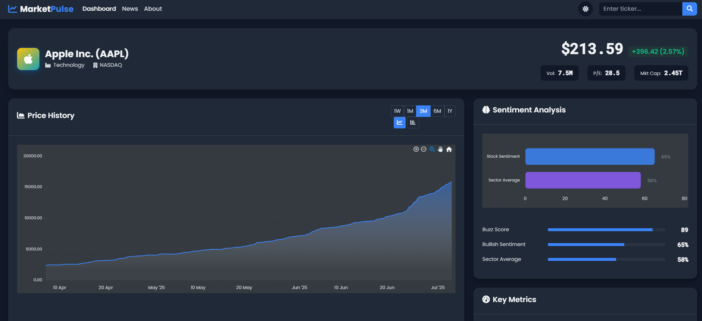
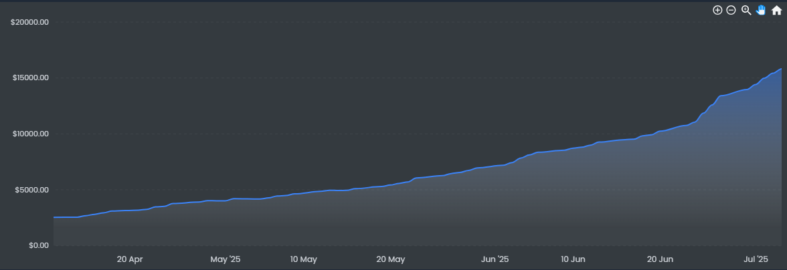
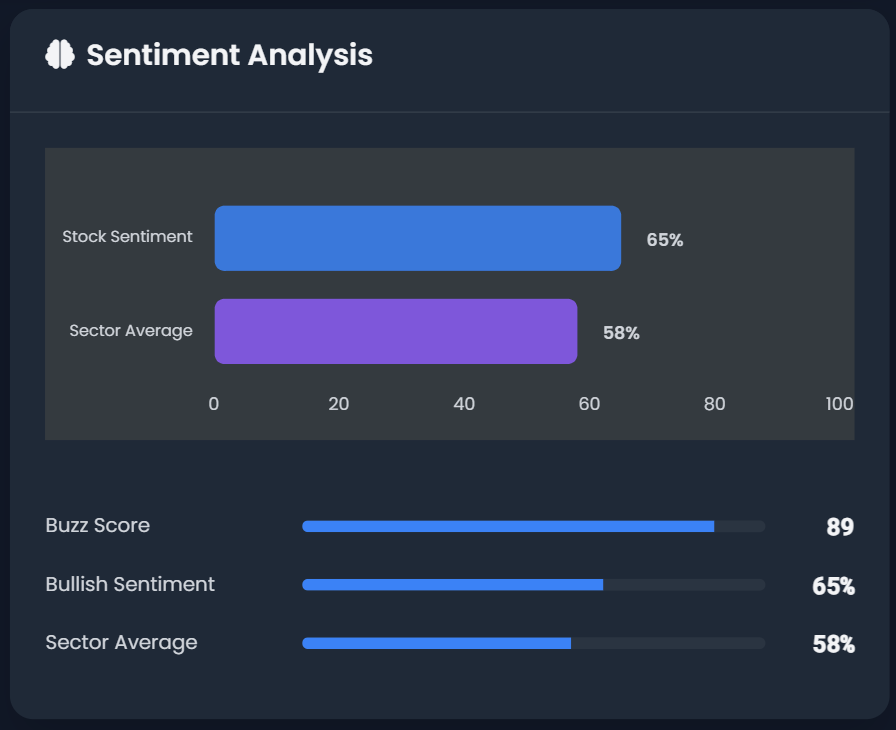
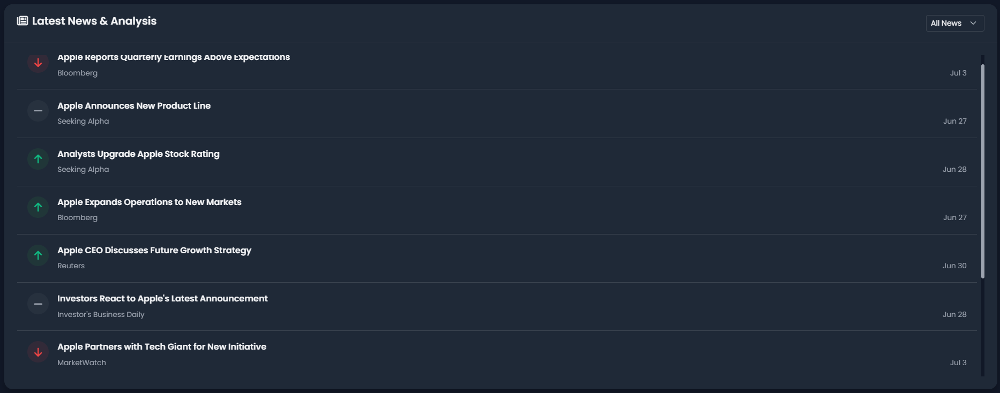
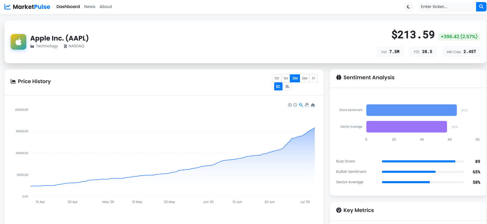

```markdown
# Market Pulse: Real-time Stock Analytics Platform

Market Pulse is an advanced financial analytics dashboard that combines real-time stock data, news sentiment analysis, and interactive visualizations to provide investors with comprehensive market insights in an elegant, user-friendly interface.



## ✨ Features

### Interactive Stock Visualization
- Real-time and historical stock price data
- Toggle between line and candlestick charts
- Customizable time ranges (1W, 1M, 3M, 6M, 1Y)
- Responsive charts with zoom and pan capabilities



### AI-Powered Sentiment Analysis
- News article sentiment scoring using natural language processing
- Comparative analysis between stock sentiment and sector averages
- Visual sentiment indicators with intuitive color coding



### Financial News Integration
- Real-time news aggregation for selected companies
- Sentiment-coded news items (positive, negative, neutral)
- Filterable news feed based on sentiment



### Elegant User Experience
- Responsive design works on all devices
- Dark/light mode toggle with system preference detection
- Interactive animations and data visualizations
- Clean, intuitive layout optimized for financial data



## 🛠️ Technologies Used

### Frontend
- HTML5, CSS3, JavaScript
- Bootstrap 5.3 for responsive layout
- ApexCharts.js for advanced data visualization
- Font Awesome for icons
- Google Fonts (Poppins, Roboto Mono)
- AOS library for scroll animations

### Backend
- Python with Flask framework
- TextBlob for natural language processing
- Custom caching system

### APIs
- Alpha Vantage API for stock market data
- NewsAPI for company news
- Finnhub API for social sentiment metrics

## 📊 API Integration

Market Pulse intelligently integrates multiple financial data sources:

1. **Alpha Vantage API**: Provides historical and intraday stock price data, including OHLC (Open, High, Low, Close) values and trading volume.

2. **NewsAPI**: Delivers relevant news articles about selected companies, which are then processed for sentiment analysis.

3. **Finnhub API**: Supplies social sentiment metrics, including bullish percentage and sector comparisons.

Our application implements a smart caching system that optimizes API usage while ensuring data freshness. If any API fails or rate limits are reached, the system seamlessly falls back to realistic mock data to ensure uninterrupted user experience.

## 🚀 Installation Instructions

### Prerequisites
- Python 3.7 or higher
- pip package manager

### Setup Steps

1. **Clone the repository**
```bash
git clone https://github.com/your-username/market-pulse.git
cd market-pulse
```

2. **Install dependencies**
```bash
pip install -r requirements.txt
```

3. **Set up API keys** (optional - system works with mock data if APIs are unavailable)
```bash
# Create a .env file in the project root with your API keys
ALPHAVANTAGE_API_KEY=your_alphavantage_api_key
NEWS_API_KEY=your_newsapi_key
FINNHUB_API_KEY=your_finnhub_api_key
```

4. **Run the application**
```bash
python app.py
```

5. **Access the application**  
Open your browser and navigate to `http://127.0.0.1:5000`

## 📱 Usage Guide

### Searching for Stocks
Enter a stock ticker symbol (e.g., AAPL, MSFT, GOOGL) in the search box and press Enter or click the search button.


### Analyzing Stock Data
- Use the time range buttons (1W, 1M, 3M, 6M, 1Y) to adjust the chart period
- Toggle between line and candlestick charts using the chart type buttons
- Hover over chart points to view detailed price information

### Reading News and Sentiment
- Browse the latest news related to the selected company
- Use the sentiment filter dropdown to view only positive, negative, or neutral news
- Check the sentiment metrics to compare company sentiment against sector averages

### Customizing Your Experience
- Toggle between dark and light mode using the theme switch in the upper right corner
- Explore company metrics in the information cards

## 🛣️ Future Roadmap

- Portfolio tracking functionality
- Advanced technical indicators
- Customizable watchlists
- Price alerts and notifications
- Machine learning-based price predictions
- Advanced portfolio analytics
- Mobile app version

## 👥 Team

- [Team Member 1] - Role
- [Team Member 2] - Role
- [Team Member 3] - Role
- [Team Member 4] - Role

## 📄 License

This project is licensed under the MIT License - see the LICENSE file for details.

## 🙏 Acknowledgements

- [Alpha Vantage](https://www.alphavantage.co/) for financial market data
- [NewsAPI](https://newsapi.org/) for news aggregation
- [Finnhub](https://finnhub.io/) for market sentiment data
- [ApexCharts](https://apexcharts.com/) for interactive data visualization
- [Bootstrap](https://getbootstrap.com/) for responsive design components

---

*Developed for the Call2Code Hackathon 2025*
```