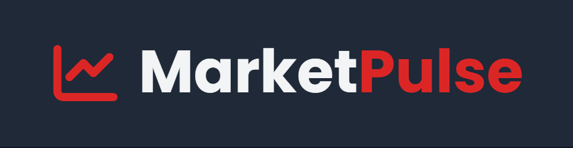
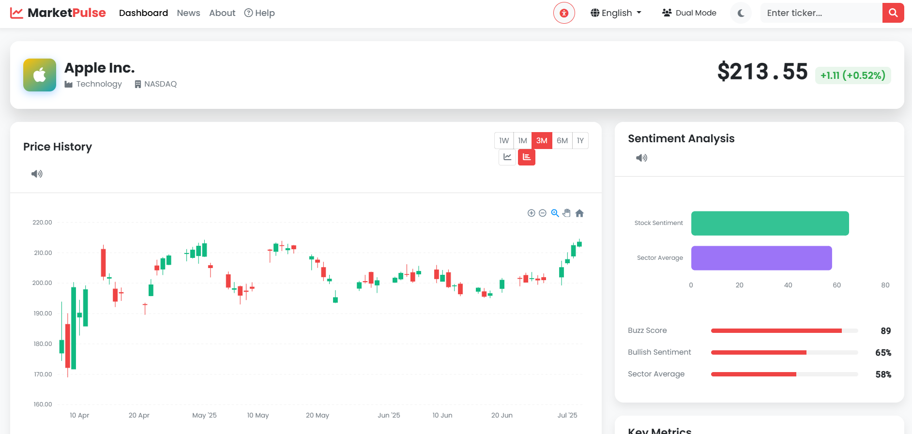
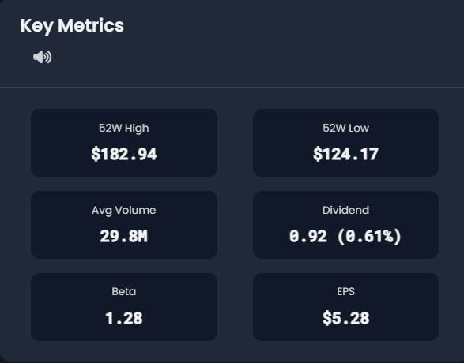
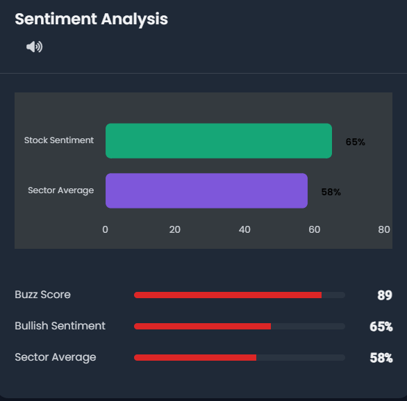
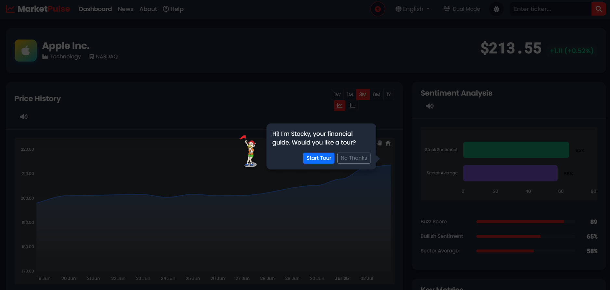
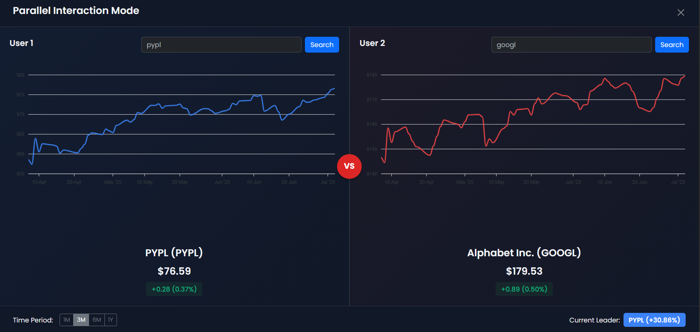

# MarketPulse - Advanced Stock Analytics Platform



## 📊 Real-time Stock Analytics with AI-Powered Insights

MarketPulse is a comprehensive stock analytics platform that combines real-time market data with AI-driven sentiment analysis to provide investors with powerful insights. Featuring interactive visualizations, news sentiment scoring, and technical indicators, MarketPulse helps users make more informed investment decisions.

---


## 🎮 Demo

### Dashboard Overview



### Real-time Analytics

Check out our [live demo]([https://money-pal.onrender.com/]) to experience the platform in action.

---

## ✨ Features

### 📈 Real-time Stock Data
- Live price updates for thousands of stocks
- Historical price data with multiple timeframes
- Volume analysis and trading indicators
- Interactive price charts (line and candlestick)



### 🧠 AI-Powered Sentiment Analysis
- News sentiment scoring using natural language processing
- Social media trend analysis
- Sector sentiment comparison
- Bullish/bearish indicators based on news coverage



### 📰 News Aggregation
- Latest news articles related to stocks
- Sentiment-categorized news feed
- Source credibility scoring
- Click-through to original articles

### 📊 Interactive Visualizations
- Customizable charts with zoom functionality
- Multiple timeframes (1D, 5D, 1M, 6M, 1Y, 5Y)
- Technical indicators overlay
- Side-by-side stock comparison

### 🌙 Light/Dark Mode
- Automatic theme detection based on system preferences
- Manual theme toggle
- Theme-responsive visualizations

### 🚀 Additional Features
- Responsive design for desktop and mobile
- Intelligent data caching system
- Interactive tutorial/onboarding
- Voice navigation capabilities (beta)
- Parallel comparison mode

---

## 🛠️ Tech Stack

### Frontend
- **HTML5/CSS3** - Modern, semantic markup
- **JavaScript** - Interactive functionality
- **Bootstrap 5.3** - Responsive UI framework
- **ApexCharts.js** - Interactive charting library
- **Font Awesome** - Icon library
- **AOS** - Animation on scroll library

### Backend
- **Python 3.8+** - Core programming language
- **Flask** - Web framework
- **yfinance** - Yahoo Finance API wrapper
- **TextBlob** - Natural language processing for sentiment analysis
- **Pandas** - Data manipulation and analysis
- **Requests** - HTTP library for API access

### APIs
- **Alpha Vantage** - Stock price data and indicators
- **News API** - News aggregation
- **Yahoo Finance** - Complementary financial data


---

## 📥 Installation

### Prerequisites
- Python 3.8 or higher
- pip (Python package installer)
- Git

### Step 1: Clone the Repository
```bash
git clone https://github.com/Satvik-jain/Market_pulse
cd Market_pulse
```

### Step 2: Set Up a Virtual Environment
```bash
# For Windows
python -m venv venv
venv\Scripts\activate

# For macOS/Linux
python3 -m venv venv
source venv/bin/activate
```

### Step 3: Install Dependencies
```bash
pip install -r requirements.txt
```

### Step 4: Set Up Environment Variables
Create a `.env` file in the project root directory:
```
ALPHAVANTAGE_API_KEY=your_alphavantage_api_key
NEWS_API_KEY=your_newsapi_key
PORT=5000
```

### Step 5: Run the Application
```bash
python app.py
```

The application will be available at `http://127.0.0.1:5000/`.


---

## 📖 Usage Guide

### 1. Dashboard Navigation



The main dashboard provides a comprehensive overview of your selected stock with the following components:
- **Search Bar**: Enter a stock ticker (e.g., AAPL, MSFT)
- **Price Chart**: Interactive visualization of stock performance
- **Key Metrics**: Important financial indicators
- **News Feed**: Latest relevant news with sentiment indicators
- **Sentiment Analysis**: AI-powered market sentiment gauge
- **Speech Navigation**: Use speech to search, analyse and to give commands 

### 2. Stock Search

To search for a stock:
1. Click on the search bar in the top navigation
2. Enter the ticker symbol (e.g., AAPL for Apple)
3. Press Enter or click the search icon
4. The dashboard will update with data for your selected stock


### 3. Chart Interaction

The interactive chart supports:
- **Zoom**: Scroll to zoom in/out or use the zoom controls
- **Pan**: Click and drag to pan across different time periods
- **Timeframes**: Select from 1D, 5D, 1M, 6M, 1Y, 5Y using the buttons
- **Chart Types**: Toggle between line chart and candlestick views
- **Fullscreen**: Expand chart to fullscreen mode


### 4. News and Sentiment Analysis

The news section displays relevant articles with sentiment indicators:
- **Green arrows**: Positive sentiment
- **Red arrows**: Negative sentiment
- **Horizontal lines**: Neutral sentiment

You can filter news by sentiment using the filter buttons above the news feed.


### 5. Theme Toggle

Toggle between light and dark mode by clicking the sun/moon icon in the navigation bar.


### 6. Parallel Mode

Compare two stocks side by side:
1. Click the "Dual Mode" button next to the search bar
2. Enter the ticker for the second stock
3. View both stocks' data simultaneously



### 7. Guided Tour

New users will automatically be offered a guided tour. Returning users can access the tour anytime by clicking the Help button.


---

## 🔌 API Documentation

MarketPulse provides internal API endpoints for data retrieval and analysis. Here's how to use them:

### Stock Data API

**Endpoint**: `/api/stock_data`  
**Method**: GET  
**Parameters**:  
- `ticker` (required): Stock ticker symbol (e.g., AAPL)

**Response Example**:
```json
[
  {
    "date": "2023-07-01",
    "open": 185.40,
    "high": 187.20,
    "low": 184.75,
    "close": 186.02,
    "volume": 57284900
  },
  // More data points...
]
```

### Company News API

**Endpoint**: `/api/company_news`  
**Method**: GET  
**Parameters**:  
- `ticker` (required): Stock ticker symbol (e.g., AAPL)

**Response Example**:
```json
[
  {
    "title": "Apple Announces New iPhone Launch Date",
    "source": "TechCrunch",
    "url": "https://techcrunch.com/2023/07/01/apple-iphone-launch",
    "publishedAt": "2023-07-01T14:30:00Z",
    "sentiment": 0.65,
    "sentiment_label": "positive"
  },
  // More news items...
]
```

### Stock Sentiment API

**Endpoint**: `/api/stock_sentiment`  
**Method**: GET  
**Parameters**:  
- `ticker` (required): Stock ticker symbol (e.g., AAPL)

**Response Example**:
```json
{
  "buzz": 0.89,
  "sentiment_score": 0.65,
  "sector_sentiment": 0.58
}
```

### Ticker Validation API

**Endpoint**: `/api/validate_ticker`  
**Method**: GET  
**Parameters**:  
- `ticker` (required): Stock ticker symbol to validate

**Response Example**:
```json
{
  "valid": true,
  "ticker": "AAPL"
}
```

---

## 📁 Project Structure

```
📦 Market_pulse
├─ .gitignore
├─ README.md
├─ app.py
├─ requirements.txt
├─ screenshots
│  ├─ dashboard_main.png
│  ├─ light_mode.png
│  ├─ news_feed.png
│  ├─ sentiment_analysis.png
│  └─ stock_charts.png
├─ static
│  ├─ css
│  │  └─ style.css
│  ├─ img
│  │  └─ guide-character.png
│  └─ js
│     ├─ charts.js
│     └─ main.js
└─ templates
   ├─ about.html
   └─ index.html
```

---

## 👥 Contributing

We welcome contributions to MarketPulse! Here's how to get started:

### 1. Fork the Repository
Click the "Fork" button at the top right of this repository.

### 2. Clone Your Fork
```bash
git clone https://github.com/Satvik-jain/Market_pulse.git
cd Market_pulse
```

### 3. Create a Branch
```bash
git checkout -b feature/your-feature-name
```

### 4. Make Your Changes
Implement your feature or bug fix.


### 5. Commit Your Changes
```bash
git commit -m "Add feature: your feature description"
```

### 6. Push to GitHub
```bash
git push origin feature/your-feature-name
```

### 8. Create a Pull Request
Go to your fork on GitHub and click "New pull request".

### Coding Standards
- Follow PEP 8 style guide for Python code
- Use camelCase for JavaScript functions and variables
- Include comments for complex logic
- Write unit tests for new functionality

---

## 📜 License

This project is licensed under the MIT License
---

## 🙏 Acknowledgments

- [Alpha Vantage](https://www.alphavantage.co/) for financial data APIs
- [News API](https://newsapi.org/) for news aggregation
- [TextBlob](https://textblob.readthedocs.io/) for sentiment analysis
- [ApexCharts](https://apexcharts.com/) for interactive charts
- [Bootstrap](https://getbootstrap.com/) for UI components
- [Font Awesome](https://fontawesome.com/) for icons

---

## 📞 Contact

- **Project Maintainer**: Satvik Jain
- **Email**: satvik.jain.kht@gmail.com

For support requests, please open an issue on this repository or contact the maintainer directly.

---


**MarketPulse** - Empowering investors with data-driven insights  
© 2025 MarketPulse Team
